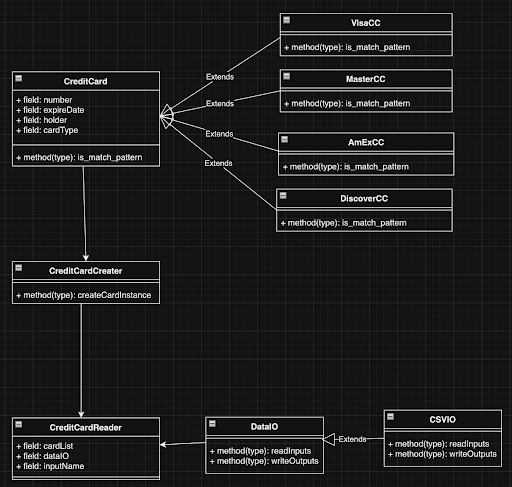
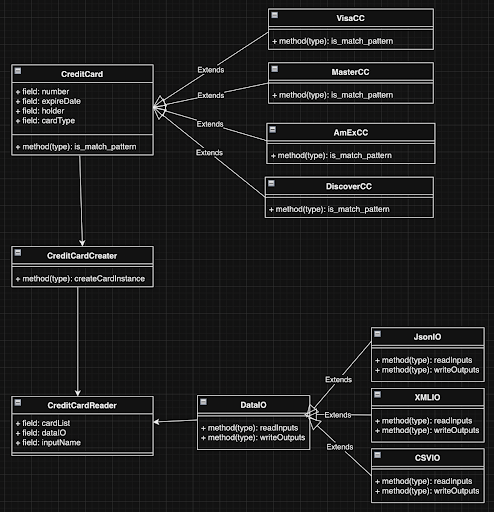

# CMPE 202 - Individual Project

**Student Name:** Ivy Vo (Truc Vo)
**Student ID:** 011071489  
**Git Repository:** [Individual Project Repository]https://github.com/gopinathsjsu/individual-project-nhatruc3010)

## Primary Problem

The primary problem I try to solve is designing with object oriented concepts. From the given problem, we can create two abstract classes: credit card and data IO since we have multiple types of credit cards and input types. The design should have flexibility to accept other types of credit card and input types in the future. In order to unify the function format, we create an abstract class for credit card and data IO and then extend it with sub class. 

### Design Pattern

The design pattern I used in the project is polymorphism and inheritance. As a result, with the abstract class, we abstracted different types of credit cards into one class and simplified interfaces. Moreover, thanks to this simplified interface, it is easy to add other different types of card. 

### Credit Card Object Class Diagram

## Secondary Problem

The secondary problem from the Part1, I extended input formats. We have three different types of input reader Json, XML and CSV. Based on the input extension, different reader will be used. 

### Design Pattern: 

The design pattern that I used is the Factory Method Pattern. 

### Class Diagram

### Overall Class Diagram

---